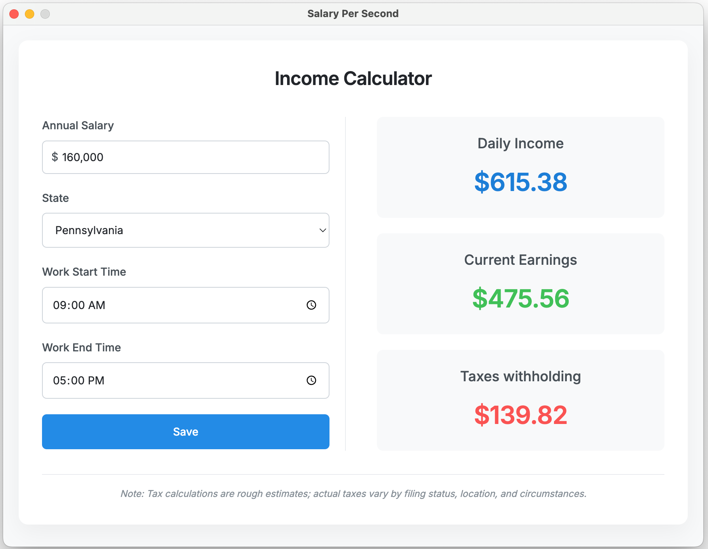
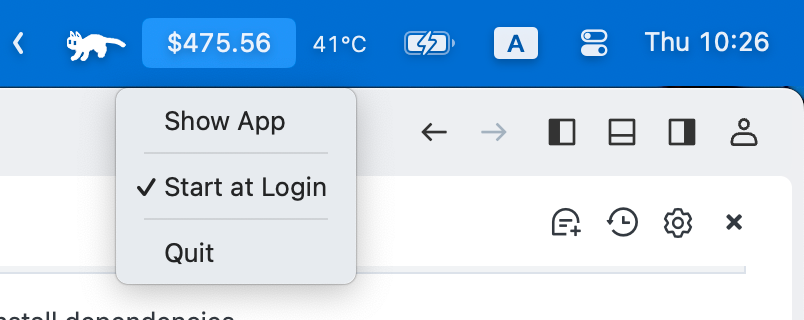

# Salary Runner


## Logo and app screenshot
App main window


Menu bar



## About
Salary Runner is an Electron-based desktop application that helps you visualize your earnings in real-time. Watch your salary accumulate second by second with this intuitive and engaging tool.

### Features
- Real-time salary calculation
- Visual representation of earnings
- Customizable salary input
- Cross-platform compatibility (Windows, macOS, Linux)
- User-friendly interface

## Getting Started

### Prerequisites
- Node.js (v18 or higher)
- npm or yarn

### Installation
1. Clone the repository
```bash
git clone git@github.com:haoliu350/Salary-Per-Second.git
```
2. Navigate to the project directory
```bash
cd Salary-Per-Second
```
3. Install dependencies
```bash
npm install
```
4. Build the application
```bash
npm run package
```

## MIT License
MIT License

Copyright (c) 2025 Hao Liu
<sub>
Permission is hereby granted, free of charge, to any person obtaining a copy
of this software and associated documentation files (the "Software"), to deal
in the Software without restriction, including without limitation the rights
to use, copy, modify, merge, publish, distribute, sublicense, and/or sell
copies of the Software, and to permit persons to whom the Software is
furnished to do so, subject to the following conditions:

The above copyright notice and this permission notice shall be included in all
copies or substantial portions of the Software.

THE SOFTWARE IS PROVIDED "AS IS", WITHOUT WARRANTY OF ANY KIND, EXPRESS OR
IMPLIED, INCLUDING BUT NOT LIMITED TO THE WARRANTIES OF MERCHANTABILITY,
FITNESS FOR A PARTICULAR PURPOSE AND NONINFRINGEMENT. IN NO EVENT SHALL THE
AUTHORS OR COPYRIGHT HOLDERS BE LIABLE FOR ANY CLAIM, DAMAGES OR OTHER
LIABILITY, WHETHER IN AN ACTION OF CONTRACT, TORT OR OTHERWISE, ARISING FROM,
OUT OF OR IN CONNECTION WITH THE SOFTWARE OR THE USE OR OTHER DEALINGS IN THE
SOFTWARE.
</sub>

